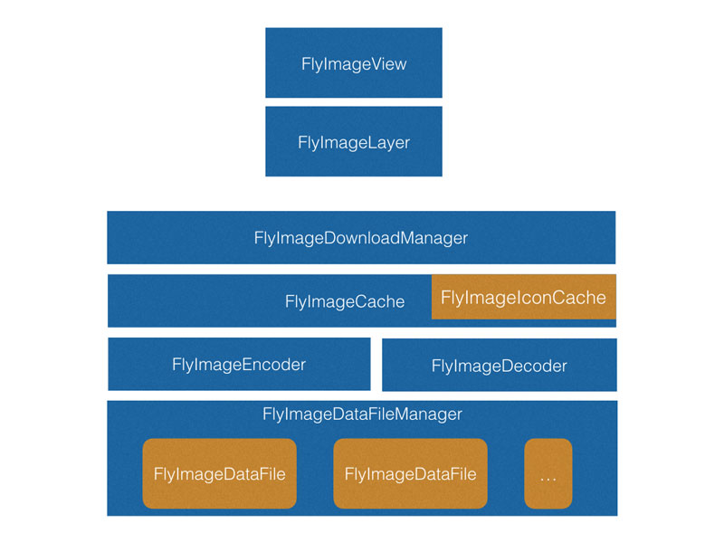

 FlyImage
=========
[](https://travis-ci.org/northwind/FlyImage)
[](http://cocoadocs.org/docsets/FlyImage/)
[](http://cocoadocs.org/docsets/FlyImage/)
[](https://www.apache.org/licenses/LICENSE-2.0.html)
[](https://github.com/northwind/FlyImage)

FlyImage takes the advantages of [SDWebImage](https://github.com/rs/SDWebImage), [FastImageCache](https://github.com/path/FastImageCache) and [AFNetworking](https://github.com/AFNetworking/AFNetworking), is a simple and high performance image library. 

Features:

- High Performance, reduce memory operations while rendering, avoid `Memory warning` caused by image
- Store and retrieve different size of small images in one memory file, smooth scrolling
- Simple, support `UIImageView`, `CALayer` category
- An asynchronous image downloader
- Support `WebP` format
- Support `mmap` to improve I/O performace

## Installation with CocoaPods

Set the Podfile like this:

```
platform :ios, '8.0'
pod 'FlyImage', '~>1.0'
```


If you are using Swift, be sure to add `use_frameworks!`:

```
platform :ios, '8.0'
use_frameworks!
pod 'FlyImage', '~>1.0'
```

If you want to support `WebP`, just change the Podfile:

```
platform :ios, '8.0'
pod 'FlyImage/WebP', '~>1.0'
```

## How To Use

Using UIImageView and CALayer Category

```objective-c
#import "FlyImage.h"
...

UIImageView *imageView = [[UIImageView alloc] initWithFrame:frame];
[imageView setPlaceHolderImageName:@"default"
						thumbnailURL:[NSURL urlWithString:@"http://thumbnail"]
						originalURL:[NSURL urlWithString:@"http://original"]];
[]self.view addSubview:imageView];
...

UIImageView *iconView = [[UIImageView alloc] initWithFrame:frame];
[iconView setIconURL:[NSURL urlWithString:@"http://original"]];
[]self.view addSubview:iconView];
...

```

Using FlyImageCache

```objective-c
// retrieve a specific key, and get callback
[[FlyImageCache sharedInstance] asyncGetImageWithKey:key
	  									   completed:^(NSString *key, UIImage *image) {
		imageView.image = image;
}];

// remove a image from the cache	
[[FlyImageCache sharedInstance] removeImageWithKey:key];

// delete all images
[[FlyImageCache sharedInstance] purge];

```

Using FlyImageIconCache

```objective-c
// add a new icon with a specific key
[[FlyImageIconCache sharedInstance] addImageWithKey:key
        size:drawSize
        drawingBlock:^(CGContextRef context, CGRect contextBounds) {
        	UIImage *image = [UIImage imageWithName:@"imageName"];

    		UIGraphicsPushContext(context);
		    [image drawInRect:contextBounds];
		    UIGraphicsPopContext();
        }
        completed:nil];

// retrieve a specific key, and get callback
[[FlyImageCache sharedInstance] asyncGetImageWithKey:key
	  									   completed:^(NSString *key, UIImage *image) {
		imageView.image = image;
}];

```

More demos in folder [Examples](https://github.com/northwind/FlyImage/tree/master/Examples)


## Performance Mesure


#### Memory when scrolling images

> Demo Target: FlyImageView / Device: iPhone6 Plus

Memory | FlyImage | SDWebImage | UIKit
------------ | ------------ | ------------- | ------------
All Heap Allocations | 2~7M | 2~4M  | 2~5M
All Anonymous VM | 17~30M | 310M  | 17~30M


#### FPS when more than 170 small images in the same screen

> Demo Target: FlyImageIconView / Device: iPhone6 Plus

FlyImage | SDWebImage | UIKit
------------ | ------------- | ------------
58~60FPS | 6~7FPS  | 6~7FPS 


## Architecture



## License

FlyImage is made available under the [MIT license](http://opensource.org/licenses/MIT)

